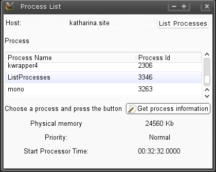
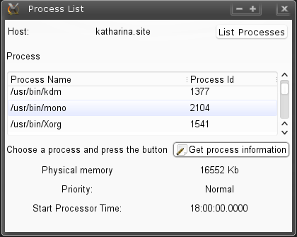

# Usando la clase Process de .NET

La definición clásica de proceso <i><tt>[1]</tt></i> nos dice que un proceso <i>"es un programa en ejecución"</i>  también nos señala que un proceso es más que un programa, ya que por programa se refiere únicamente al conjunto de instrucciones que se van ejecutando dentro del proceso, por lo que subraya que un proceso es una entidad activa que tiene un contador de programa (program counter), un conjunto de recursos asociados  y ese conjunto de instrucciones que están representadas por el programa. Un proceso tiene los siguientes estados durante su ejecución:
<ol>
<li><b>Nuevo (New):</b> El proceso se ha creado</li>
<li><b>En ejecución (Running):</b> Las instrucciones están siendo ejecutadas.</li>
<li><b>En espera (Waiting):</b> El proceso esta en espera de algún evento ocurra.</li>
<li><b>Listo (Ready):</b> El proceso esta en espera de una asignación del procesador.</li>
<li><b>Terminado (Terminated):</b> El proceso ha terminado su ejecución.</li>
</ol>

.NET proporciona la clase <a href=”http://msdn.microsoft.com/en-us/library/system.diagnostics.process.aspx”>Process</a> que representa un proceso del sistema operativo con todas sus propiedades y operaciones, esta clase se encuentra dentro del ensamblado <i>System.Diagnostics</i>. A continuación mostramos el listado correspondiente a un proyecto GTK# de <a href="http://www.monodevelop.com">MonoDevelop</a>, este programa sencillo muestra el uso de esta clase.

Primeramente obtenemos el nombre del host del cuál obtendremos sus procesos en ejecucción, este nombre lo asignamos a una variable de tipo <i>string</i> para después mostrarlo en una etiqueta de la interfaz gráfica  
<pre>
lbMachineName.Text = machineName = System.Environment.MachineName;
</pre>
Teniendo el nombre del host, entonces con el metódo estático <i>GetProcesses</i> de la clase <i>Process</i> obtenemos un arreglo de procesos representados mediante la clase <i>Process</i>, este arreglo sera nuestro model (Model) para mostrar en el control <i> GTK# TreeView</i> de la interfaz gráfica, a continuación el código con el cuál realizamos esta función:
 
<pre>
var resp = (from p in Process.GetProcesses(machineName) 
where p.Id > 100 
orderby p.ProcessName ascending select p);
Process[] arrProcesses = resp.ToArray();
</pre>
Por útimo obtemos la información detallada del proceso, con el metódo estático <i>GetProcessById</i> un metódo que recibe como argumento un entero representando el pid (process identifier), esto se realiza con el código siguiente: 

<pre>
TreePath[] selected_paths = trProcessList.Selection.GetSelectedRows ();
TreeIter iter;
int pid;
foreach (TreePath p in selected_paths)
{
	if (store.GetIter (out iter, p)) 
	{
	pid = Convert.ToInt32(store.GetValue(iter,1));
	Process process = Process.GetProcessById(pid);
	lbVirtualMemory.Text = Convert.ToString(process.WorkingSet64 / 1024) + " Kb";
	lbPriority.Text = process.PriorityClass.ToString();
	lbStartProcessorTime.Text = process.StartTime.ToString("HH:mm:ss.ffff");
 	}
 }
 </pre>

Las siguientes imagenes muestran el programa en ejecucción
 

 
 

 

<i>[1]Basado en el libro “Operating System Concepts”, Silberschatz Abraham, Baer Galvin Peter, Greg Gagne; John Wiley & Sons inc, 7 edición, 2005, Chapter 3</i> 

